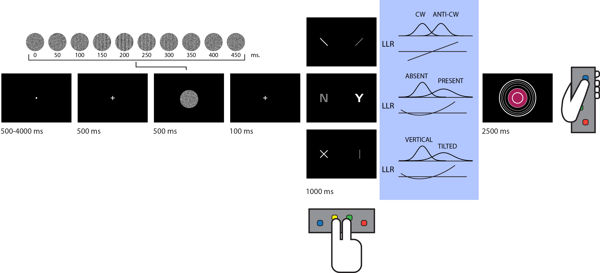

# Re-evaluating frontopolar and temporoparietal contributions to detection and discrimination confidence

with Chudi Gong 🧠 and Steve Fleming 🧠

To run the experiment:

1. Load 'experiment\data\subjects.mat'. This is a dictionary with paricipant identifiers as keys and numeral values. A value of 1 means higher confidence is mapped to bigger circles. A value of 2 means lower confidence is mapped to bigger circles.
2. Add a participant identifier that starts with a 3-digit number. For example, to add the participant '001KaFr', and to map high confidence to big circles, type in `subjects('001KaFr')=1`.
3. Save the ammended subject list (`save('experiment\data\subjects.mat','subjects')`).
4. Run the _openEndedCalibration.m_ function from within the experiment directory. In the user input box, type in the participant identifier you added to the subjects list. This function will calibrate transparency for each of the three tasks to reach around 70% accuracy.
5. Now _main.m_ can be run. To practice discrimination, detection, or tilt recognition, type '10','11', or '12' in the _practice_ field. Otherwise, type '0'.

Our analysis is written in Matlab (tested on version R2022a, including the Statistics and Machine Learning toolbox), using SPM12. Our pre-registration document can be found in our [time-locked protocol folder](https://github.com/matanmazor/unequalVarianceDiscrimination/tree/main/experiment/protocolFolder/protocolFolder) (hash: 7c2c27da12b6768b1789907ba5d2ec46b45d302199d5368795879fcff844d043). To reproduce our analysis, do the following:

1. Clone this repository.
2. The behavioural analysis can be run from [analysis\Behaviour.mlx](https://github.com/matanmazor/unequalVarianceDiscrimination/blob/main/analysis/Behaviour.mlx).
3. Set the project parameters by editing and then running the file makeProjectParams.m. Most importantly, edit the location of the SPM directory.
4. The function excludeSubjects.m saves to the global workspace the variable `which_subjects`, which is required for all further analyses. The object `project_params` can be loaded from the analysis directory.
5. Download the anonymized imaging dataset from openNeuro (dataset identifier: [ds004081](https://openneuro.org/datasets/ds004081)), and place its contents in the directory data/data. If you don't want to run all the preprocessing yourself and interested in the ROI results, we provide ROI-specific summary statistics for each subject, as well as anatomical masks in native space, in data/ROI_data.
6. Imaging data were preprocessed as described in the paper, and using the [MetaLab core scripts](https://github.com/matanmazor/MetaLabCore). These scripts take as input the data in the raw format, as obtained from the scanner.
6. To generate the design matrices, run [makeDesignMatrices.mlx](https://github.com/matanmazor/unequalVarianceDiscrimination/blob/main/analysis/makeDesignMatrices.mlx). The Quadratic-Confidence Design Matrix is DM1555, and the Categorical-Confidence Design Matrices are DM10555, DM11555 and DM12555. Physiological recordings are available in the directory in data/rawData/physioDataFromPenta.
These design matrices can then be used to specify the model in SPM, using the function [modelSpecEst](https://github.com/matanmazor/MetaLabCore/blob/master/Stats/modelSpecEst.m).
7. Visualization and analysis of coefficients from the categorical design matrix is done by running [analyzeCategorical.mlx](https://github.com/matanmazor/unequalVarianceDiscrimination/blob/main/analysis/analyzeCategorical.mlx)
8. To run the RSA analysis:
* generate the appropriate design matrices using the function tsv2DM2.m.
* Specify and estimate the model using the function [modelSpecEst4SL.m](https://github.com/matanmazor/MetaLabCore/blob/master/Stats/modelSpecEst4SL.m)
* Run [RSA.mlx](https://github.com/matanmazor/unequalVarianceDiscrimination/blob/main/analysis/runRSA.mlx) (can be done without the first two steps, using the provided voxel-wise beta-values from the ROIs).
9. To run the multiple regression analysis on RDMs, run [multipleRegression.mlx](https://github.com/matanmazor/unequalVarianceDiscrimination/blob/main/analysis/multipleRegression.mlx)
